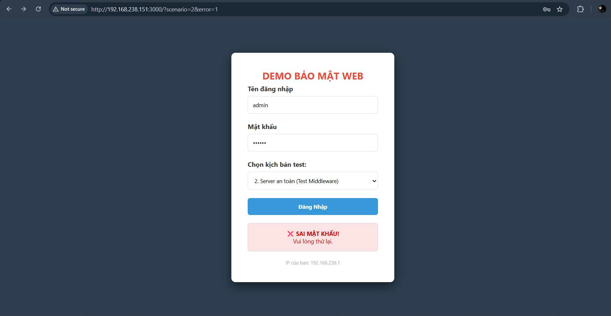
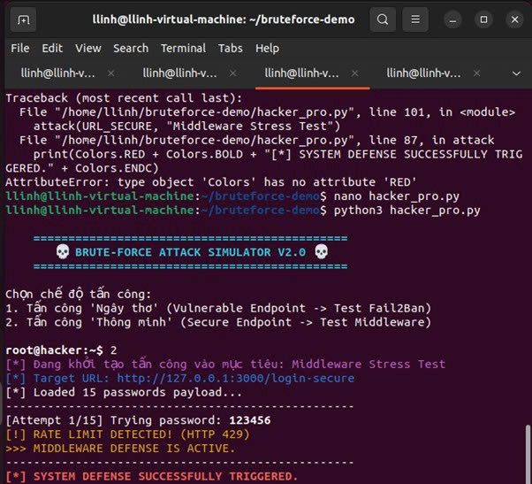
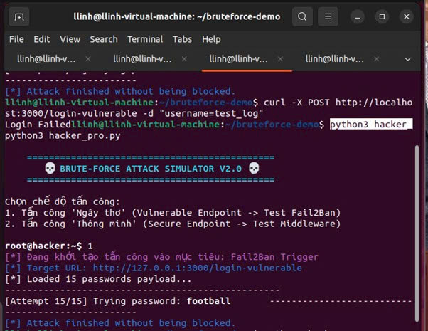
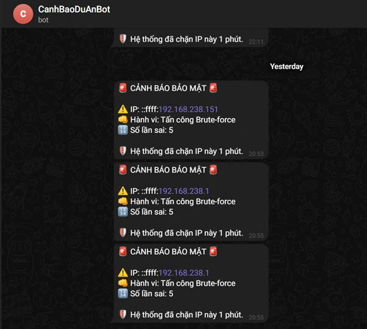
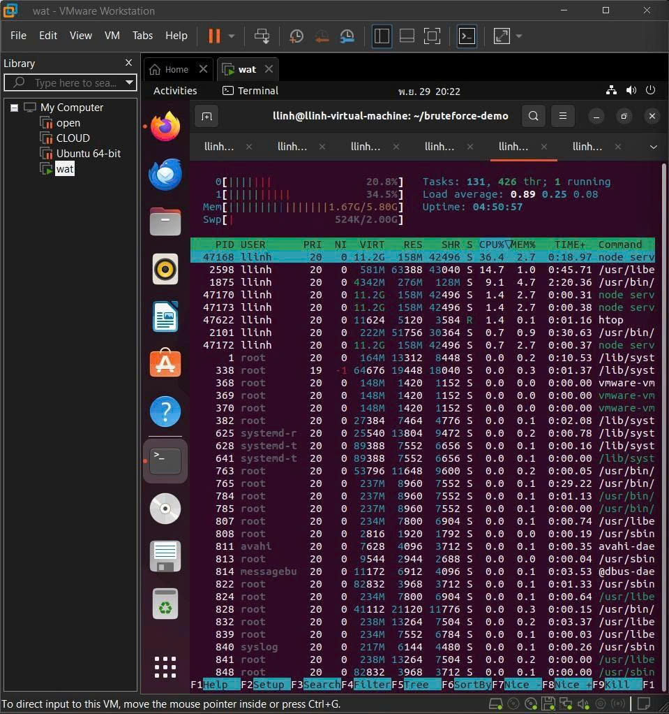

# Phát hiện và Ngăn chặn Brute-force

Giải pháp proof-of-concept kết hợp Node.js/Express, middleware rate limiting và Fail2Ban để giám sát log, khóa IP tấn công và gửi cảnh báo realtime qua Telegram. Bộ demo kèm công cụ tấn công Python để minh họa chuỗi phòng thủ nhiều lớp.

## Thành viên & Vai trò
| STT | Họ và tên | MSSV | Vai trò | Mảng phụ trách chính |
| --- | --- | --- | --- | --- |
| 1 | Lê Hồng Linh | 22810310058 | Nhóm trưởng | Thiết kế kiến trúc, xây dựng server Express, cấu hình Fail2Ban/iptables, tích hợp Telegram |
| 2 | Nguyễn Xuân Hoàng Cường | 22810310036 | Thành viên | Phát triển middleware rate limit, viết tool tấn công Python, tổng hợp tài liệu & demo |

## Phân chia công việc chi tiết
- **Lê Hồng Linh:** dựng môi trường Ubuntu/Node, chuẩn hóa định dạng log `auth.log`, tạo jail Fail2Ban, viết script cảnh báo Telegram, viết báo cáo chương 1-3.
- **Nguyễn Xuân Hoàng Cường:** phát triển `hacker_pro.py`, bổ sung UI chọn kịch bản trong `server.js`, triển khai middleware đếm tần suất, thực hiện kiểm thử/demoshoot.
- **Cả nhóm:** hoàn thiện tài liệu `baocao.md`, quay/tổng hợp minh chứng, viết phần kết luận và đề xuất mở rộng.

## Cấu trúc mã nguồn tiêu biểu
- `server.js`: web server Express với hai endpoint `/login-vulnerable` (cho Fail2Ban đọc log) và `/login-secure` (middleware giới hạn 5 lần thử/IP trước khi trả HTTP 429 + log `[ABUSE]`).
- `hacker_pro.py`: mô phỏng brute-force dictionary attack, phân biệt phản hồi 200/401/429 và phát hiện khi bị Fail2Ban chặn kết nối.
- `jail.local`: ví dụ cấu hình jail Fail2Ban đọc log Node và thực thi `iptables-allports`.
- `index.html`: giao diện mặc định được render trực tiếp từ `server.js` (chọn kịch bản test, hiển thị trạng thái IP/alert).
- `baocao.md`: báo cáo học phần mô tả cơ sở lý thuyết, quy trình triển khai và kết quả.

## Hướng dẫn sử dụng
### 1. Yêu cầu hệ thống
- Ubuntu Server 22.04 (hoặc môi trường Linux có `iptables`).
- Node.js 18+, npm, Python 3.10+.
- Fail2Ban v0.11 trở lên.
- Telegram Bot token + chat id cho quản trị viên.

### 2. Khởi chạy web server & ghi log
```bash
npm install
node server.js | tee -a auth.log
```
- `server.js` tự tạo `auth.log` nếu chưa tồn tại và ghi log giờ `Asia/Ho_Chi_Minh` để khớp với Fail2Ban.
- Truy cập `http://localhost:3000` chọn kịch bản test ở combobox.

### 3. Cấu hình Fail2Ban
1. Tạo filter `/etc/fail2ban/filter.d/node-app-auth.conf`:
    ```ini
    [Definition]
    datepattern = ^%%Y-%%m-%%d %%H:%%M:%%S
    failregex = \[FAILED_LOGIN\] IP: <HOST>
                \[ABUSE\] IP: <HOST>
    ignoreregex =
    ```
2. Sao chép nội dung `jail.local` vào `/etc/fail2ban/jail.d/node-app.conf` và cập nhật `logpath` tới file `auth.log` thực tế.
3. Khởi động dịch vụ:
    ```bash
    sudo systemctl restart fail2ban
    sudo fail2ban-client status node-app-jail
    ```

### 4. Tạo cảnh báo Telegram (tùy chọn)
- Viết script `telegram_alert.sh` theo mẫu trong báo cáo, lưu vào `/etc/fail2ban/action.d/telegram.local` và tham chiếu trong `action` của jail.
- Kiểm tra bot bằng cách gọi thủ công API `sendMessage` trước khi tích hợp.

### 5. Chạy công cụ tấn công
```bash
python hacker_pro.py
```
- Chọn `1` để bắn vào `/login-vulnerable` (kích hoạt Fail2Ban sau `maxretry`).
- Chọn `2` để spam `/login-secure`, quan sát lỗi HTTP 429 và log `[ABUSE]`.

## Quy trình demo & vị trí ảnh minh họa
1. **Giao diện đăng nhập + lựa chọn kịch bản** – xác nhận server chạy và log nhận IP người dùng.



2. **Middleware chặn sau 5 lần sai** – form trả về trạng thái HTTP 429 và thông báo đỏ trên UI.



3. **Fail2Ban khóa IP** – chạy `sudo fail2ban-client status node-app-jail` thấy IP trong danh sách Ban + CLI tool báo `Connection refused`.



4. **Thông báo Telegram** – nội dung gồm IP tấn công, số lần sai, timestamp.



5. **Ngăn chặn triệt để tấn công Dictionary Attack; Tiết kiệm tài nguyên CPU.**



## Ghi chú mở rộng
- Có thể chuyển bộ đếm middleware sang Redis để chịu tải phân tán.
- Khi public bằng Ngrok, cần thêm header `X-Forwarded-For` để ghi log đúng IP nguồn.
- Đừng quên whitelist IP quản trị trong `ignoreip` của Fail2Ban khi demo trực tiếp.
